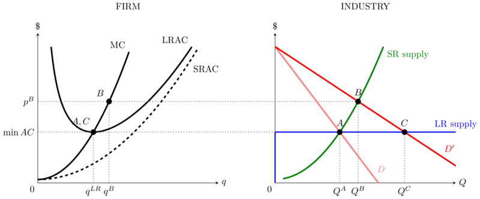
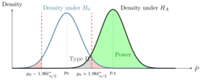

1. Utility function in 3D and its indifference curves (requires GNUPLOT)  
[[TEX](UtilityFunction3D_IndiffCurves.tex)]
[[PDF](UtilityFunction3D_IndiffCurves.pdf)]

1. Indifference curves for an arbitrary utility function (requires GNUPLOT)  
[[TEX](AnyIndiffCurves.tex)]
[[PDF](AnyIndiffCurves.pdf)]

1. Decomposing a price change into income and substitution effects (requires GNUPLOT)  
[[TEX](IncomeSubstEffects.tex)]
[[PDF](IncomeSubstEffects.pdf)]

1. Compensated and uncompensated demands  
[[TEX](Comp_Uncomp_Demands.tex)]
[[PDF](Comp_Uncomp_Demands.pdf)]

1. Long-run and short-run equilibria following change in demand 
(for arbitrary demands and cost functions) 
[[TEX](LRvsSRequil.tex)]
[[PDF](LRvsSRequil.pdf)]

1. Hypothesis testing of a single proportion  
[[TEX](HypTestingSingleProportion.tex)]
[[PDF](HypTestingSingleProportion.pdf)]
  
 Distribution under the alternative hypothesis, and power/TypeII error, can be toggled on or off.

