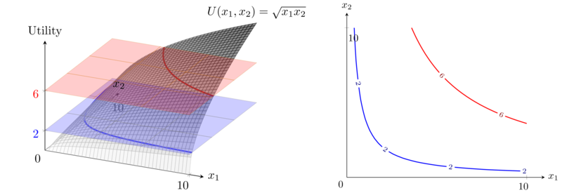
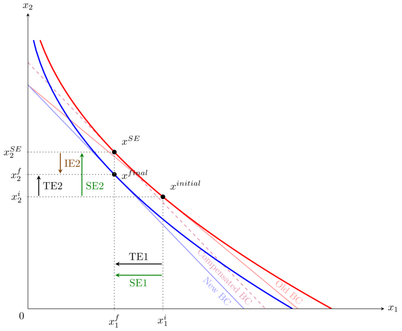

All of the codes below require the TikZ and pgfplots packages. Some also require GNUPLOT.

## Plot arbitrary utility function in 3D and its indifference curves 

Requires GNUPLOT. User can set utility function, and utility levels.

[Code: [TeX](UtilityFunction3D_IndiffCurves.tex)]
[Result: [PDF](UtilityFunction3D_IndiffCurves.pdf)]

## Indifference curves for an arbitrary utility function 

Requires GNUPLOT. User can set utility function, and utility levels.

[Code: [TeX](AnyIndiffCurves.tex)]
[Result: [PDF](AnyIndiffCurves.pdf)]

## Decomposing a price change into income and substitution effects 
Requires GNUPLOT. Arbitrary utility function, but optimal choices must be comptued manually.

[Code: [TeX](IncomeSubstEffects.tex)]
[Result: [PDF](IncomeSubstEffects.pdf)]

## Compensated and uncompensated demands
Compensated and uncompensated demand functions must be computed manually. Intersections are computed automatically. Numerical values must be computed manually.

[Code: [TeX](Comp_Uncomp_Demands.tex)]
[Result: [PDF](Comp_Uncomp_Demands.pdf)]

## Long-run and short-run equilibria following change in demand
User supplies marginal and average cost functions, and demands. The rest is computed automatically.

[Code: [TeX](LRvsSRequil.tex)]
[Result: [PDF](LRvsSRequil.pdf)]

## Consumer surplus, producer surplus, and deadweight loss under a price floor
User supplies arbitrary demand and supply functions, and the price floor, higher than the original equilibrium price. The rest is computed automatically.

[Code: [TeX](CS_PS_DWL_pricefloor.tex)]
[Result: [PDF](CS_PS_DWL_pricefloor.pdf)]

## Edgeworth Box
Requires GNUPLOT. User supplies arbitrary utility functions, and points where the indifference curves should intersect, and the contract curve. The rest is computed automatically.

[Code: [TeX](EdgeworthContractCurve.tex)]
[Result: [PDF](EdgeworthContractCurve.pdf)]

## Hypothesis testing (of a single proportion)
 Distribution under the alternative hypothesis, and power/TypeII error, can be toggled on or off.

[Code: [TeX](HypTestingSingleProportion.tex)]
[Result: [PDF](HypTestingSingleProportion.pdf)]

